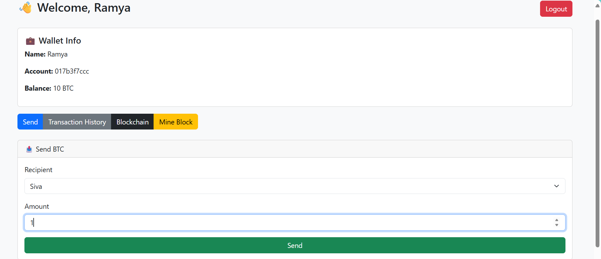
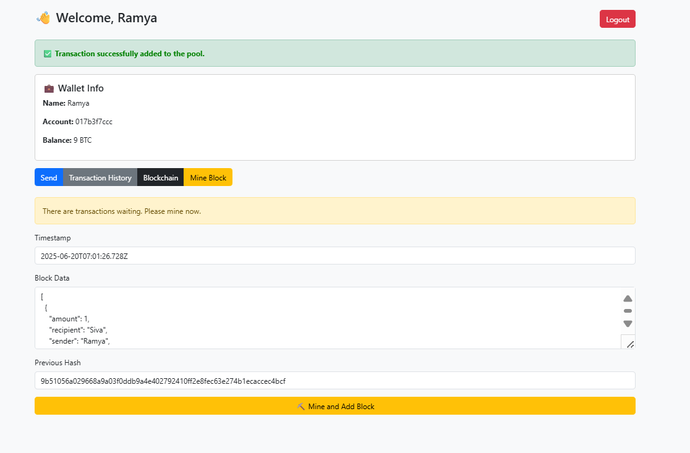

# 🪙 Bitcoin Wallet Blockchain Web App

This is a Flask-based blockchain simulation that allows users to manage wallet accounts, send and sign transactions, mine new blocks, and view the blockchain — all using secure cryptographic signatures and hash chaining.

## 🎯 Project Aim

To simulate a Bitcoin-style blockchain system that:
- Uses cryptographic wallets with digital signatures.
- Allows secure BTC transactions and block mining.
- Demonstrates blockchain structure using linked blocks.
- Explains key data structures like linked lists and hashing.

## 🚀 Features

- 🔐 Login system with predefined wallet accounts.
- 💰 Send BTC between wallets using ECDSA signatures.
- ⛏️ Mine new blocks and receive 2 BTC rewards.
- 📜 View personal transaction history.
- 🔗 Blockchain explorer showing block hashes and transactions.
- 🎨 Responsive UI using Bootstrap 5.

## 👥 Wallet Accounts

| Name     | Username | Password  |
|----------|----------|-----------|
| Ramya    | ramya    | ramya123  |
| Siva     | siva     | siva123   |
| Pavani   | pavani   | pavani123 |
| Guru     | guru     | guru123   |
| Saranya  | saranya  | saranya123|

## 📁 Project Structure

```
bitcoin-wallet-blockchain/
│
├── app.py                 # Flask app and blockchain logic  
├── requirements.txt       # Python dependencies  
├── templates/
│   ├── login.html         # Login page  
│   └── index.html         # Dashboard and blockchain UI  
├── screenshots/           # 📸 Screenshots for README preview  
└── README.md              # Project documentation  
```

## 🛠️ Tech Stack

- **Frontend**: HTML, Bootstrap 5, Jinja2  
- **Backend**: Python 3, Flask  
- **Crypto**: ECDSA, SHA-256  
- **DS Concepts**: Linked List, Hashing, Object-Oriented Design

## 🚀 How to Run the Application

### 1. Install dependencies

```bash
pip install -r requirements.txt
```

### 2. Run the Flask app

```bash
python app.py
```

### 3. Open in browser

```bash
http://127.0.0.1:5000/
```

## 🖼️ Project Preview

### 🔐 Login Page

  
> A simple and clean login interface where users can securely sign in with predefined wallet credentials.

---

### 📤 Send Transaction

  
> Easily send BTC to another user by selecting the recipient and amount. This form handles digital signature verification in the backend.

---

### 📊 Transaction History

  
> View all your past transactions neatly listed with sender, recipient, and amount transferred.

---

### 🔗 Blockchain Explorer

  
> A live blockchain explorer displaying all blocks with their hashes, previous hashes, timestamps, and included transactions.

---

### ⛏️ Mine Block

  
> If pending transactions exist, miners can fill this form with auto-filled values to validate the block. A reward of 2 BTC is given after successful validation.

---

### 🎉 Reward Animation (Post Mining)

> 🎊 After a valid block is mined, a confetti animation and a congratulatory message appear to celebrate the reward. This reinforces the gamified experience of mining.

---


## 📸 Example Use Case

- ✅ Login as a wallet user.  
- ✅ Send BTC securely to another user.  
- ✅ Mine Block to confirm transactions and earn rewards.  
- ✅ Explore Blockchain to view block hashes and contents.  
- ✅ Track Wallet Activity in the transaction history.

## ✅ Concepts Used

- **Linked List** → Blockchain chaining via `previous_hash`  
- **Hashing** → SHA-256 for block validation and immutability  
- **OOP** → Custom Wallet, Block, and Blockchain classes  
- **Digital Signature** → ECDSA for transaction verification  
- **Flask Routing** → Login, send, mine, logout  
- **Session Handling** → Tracks active user sessions

## 🎉 Thank You

This project is designed to help you learn how blockchain works using real Python code and fundamental data structures.  
Feel free to fork it, improve it, and make it your own!
